# Manga Translator — детекция пузырей/текста (YOLOv8) + OCR + перевод + редактирование

**Губанов Евгений**
**Stepik User ID: 1091911860**

Проект автоматически находит на страницах манги речевые пузыри и текст (YOLOv8), распознаёт текст внутри пузырей (OCR), переводит его на русский язык и позволяет отредактировать перевод перед сохранением готовой картинки.

## Структура репозитория

```
manga-translator/
├── README.md                    # этот файл (отчёт + описание проекта)
├── Razmetka_manual/
│   └── README.md                 # ссылка на размеченный датасет Base.zip (Google Drive)
├── Yolo/
│   ├── README.md                 # параметры и инструкции по обучению
│   ├── YOLO_MOD.ipynb            # код подготовки датасета и обучения YOLO
│   ├── best_yolo_model.pt        # лучшие веса обученной модели YOLOv8n
│   └── metrics/                  # логи и графики обучения
├── Translate/
│   ├── Manga_Last.ipynb          # код инференса: OCR → перевод → редактор → сохранение
│   └── MangaLang.zip             # архив демонстрационных картинок манги (English / Vietnam)
└── docs/
    └── report_images/            # иллюстрации из отчёта
```

## Ссылка на датасет

Размеченный датасет (`Base.zip`, архив с картинками и разметкой пузырьков/текста): https://drive.google.com/file/d/1y8EVeMEQaMLT3bqHKzt3uZZMMUas1EbO/view?usp=sharing

(подробности — [`Razmetka_manual/README.md`](Razmetka_manual/README.md))

---

## Отчёт о проделанной работе

### 1. Организация данных и структура проекта

Для выполнения работы требовалось размещение следующих файлов и архивов в директории `/content/drive/MyDrive`:

- **Base.zip** — архив с размеченными данными для обучения модели YOLO.
- **MangaLang.zip** — архив с демонстрационными изображениями манги.
- **best_yolo_model.pt** — предобученная модель YOLO, полученная в ходе обучения.

**Размеченный набор данных, упакованный в Base.zip, включает:**

- Папка `images/` — 670 изображений в формате JPEG.
- Папка `labels/` — соответствующие текстовые файлы аннотаций в формате YOLO.

Разметка выполнена для двух классов:
- **Класс 0** — пузырёк (speech bubble).
- **Класс 1** — текст внутри пузырька.

Ниже на рисунках даны примеры разметки.

<p>
  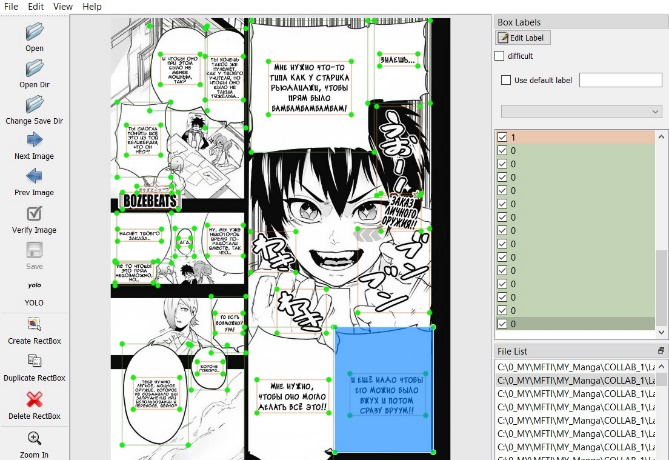
  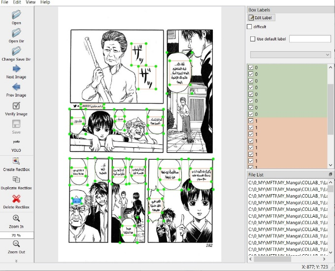
</p>
<p>
  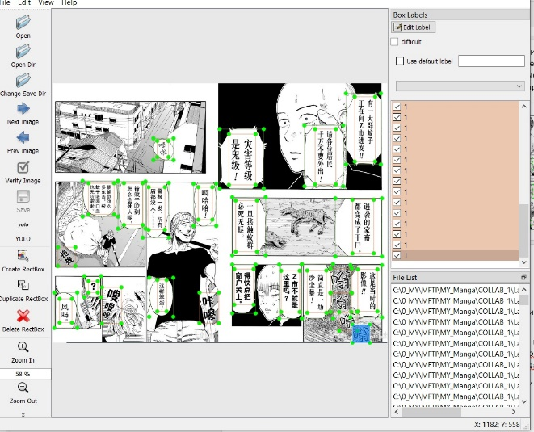
  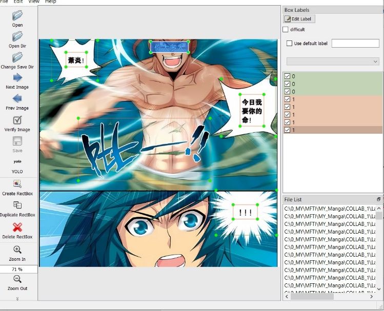
</p>

**Структура демонстрационного архива MangaLang.zip:**

```
MangaLang/MangaLang/
├── English/
│   └── 7 демонстрационных изображений на английском языке
└── Vietnam/
    └── 8 демонстрационных изображений на вьетнамском языке
```

### 2. Обучение модели YOLO

Обучение детекционной модели проводилось в ноутбуке [`Yolo/YOLO_MOD.ipynb`](Yolo/YOLO_MOD.ipynb) с использованием GPU. Процесс включал следующие этапы:

1. Монтирование Google Drive для доступа к данным:
   ```python
   from google.colab import drive
   drive.mount('/content/drive')
   ```
2. Загрузка размеченного архива `Base.zip` из директории `/content/drive/MyDrive`.
3. Конфигурация обучения:
   - Количество эпох: 80.
   - Размер батча: 32.
   - Аппаратная платформа: GPU.
4. Метрики и артефакты обучения:
   - Выходные данные сохранялись в `/content/runs/detect/yolo/bubbles_text/weights/`.
   - Сохранены контрольные точки: `best.pt` (наилучшая модель) и `last.pt` (модель после последней эпохи).
   - Графики и метрики обучения также сохранены в этой директории (в этом репозитории — [`Yolo/metrics/`](Yolo/metrics/)).
5. Наилучшая модель скопирована в корень Google Drive по пути `/content/drive/MyDrive/best_yolo_model.pt` (в этом репозитории — [`Yolo/best_yolo_model.pt`](Yolo/best_yolo_model.pt)).

<p>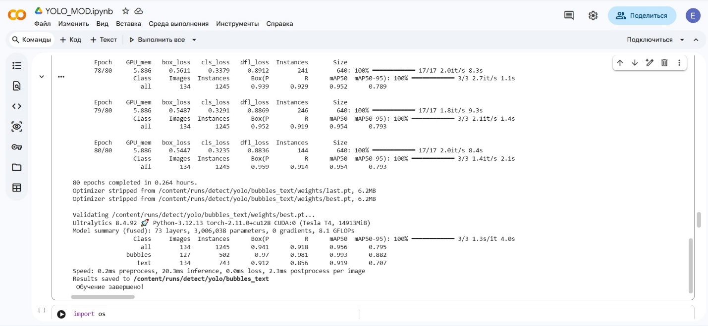</p>

### 3. Этап детекции и распознавания текста (OCR)

Основной пайплайн обработки изображений реализован в ноутбуке [`Translate/Manga_Last.ipynb`](Translate/Manga_Last.ipynb). Для его работы необходимы:
- Модель детекции: `/content/drive/MyDrive/best_yolo_model.pt`
- Демонстрационный архив: `/content/drive/MyDrive/MangaLang.zip`

#### 3.1 Выбор языка и загрузка данных

После монтирования диска и распаковки `MangaLang.zip` пользователю предлагается выбрать язык ввода:
- 0 — English
- 1 — Vietnam

<p>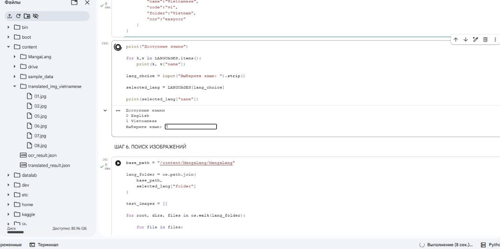</p>

Выбор определяет целевую папку с изображениями (`English/` или `Vietnam/`) для последующей обработки.

#### 3.2 Детекция пузырьков и текста

Загруженная модель YOLO применяется к каждому изображению из выбранной папки. Для каждого рисунка определяются:
- Bounding boxes пузырьков.
- Bounding boxes текстовых блоков.

Строится структура данных `page`, содержащая метаинформацию о каждом изображении (координаты боксов, уверенность, принадлежность текста к пузырьку). Количество страниц соответствует числу обработанных изображений в выбранной языковой папке.

#### 3.3 Распознавание текста (OCR)

Для извлечения текста из обнаруженных областей используется библиотека **EasyOCR** (версия 1.7.2). Распознавание сопровождается:
- Предобработкой изображения (фильтрация, повышение контраста, увеличение разрешения).
- Применением постобработки для исправления типичных ошибок OCR.

Несмотря на предпринятые меры, точность распознавания остаётся ограниченной, особенно в условиях нестандартных шрифтов и шумов манги.

Результаты OCR сохраняются в файл `ocr_result.json` со следующей структурой: для каждого изображения хранится список пузырьков с их координатами, вложенные в них текстовые блоки (координаты + распознанный текст), объединённый текст пузырька (`source_text`) и оценка уверенности распознавания.

### 4. Машинный перевод текста

Для перевода распознанного текста с английского или вьетнамского на русский язык использовалась библиотека `deep_translator` с движком `GoogleTranslator`:

```python
from deep_translator import GoogleTranslator
translator = GoogleTranslator(source="auto", target="ru")
```

Результат перевода сохраняется в файл `translated_result.json`. Структура данных дополняется полем `translated_text`, содержащим перевод каждого распознанного текстового блока.

### 5. Интерактивное редактирование перевода

Разработан модуль для ручной корректировки перевода. Процесс редактирования организован следующим образом:

1. Пользователю предлагается ввести начальный номер изображения для редактирования (от 1 до N, где N — общее число изображений в выбранной папке).

<p>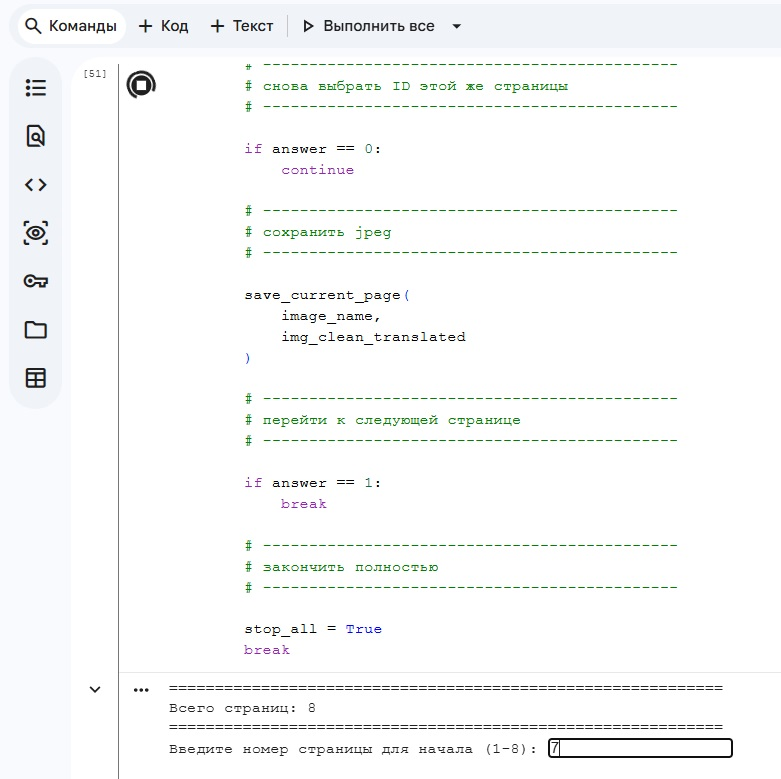</p>

2. Для каждого изображения, начиная с указанного номера, отображается интерфейс:
   - Слева: оригинальное изображение с наложенными зелёными боксами пузырьков и красными боксами текстовых областей.
   - Справа: изображение с внедрённым переводом, на котором также отображаются боксы и уникальные идентификаторы (ID) для каждого текстового поля.

3. Доступные действия для текущего изображения:
   - **Редактировать** — открывает интерфейс выбора ID текста для редактирования.
   - **Сохранить как есть** — сохраняет изображение с текущим переводом.
   - **Закончить** — завершает весь процесс редактирования.

<p>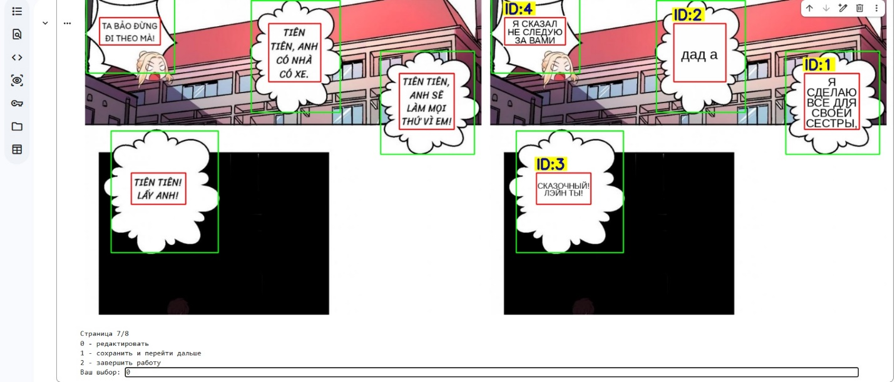</p>

4. При выборе режима редактирования:
   - Пользователь вводит ID текстового поля.

   <p>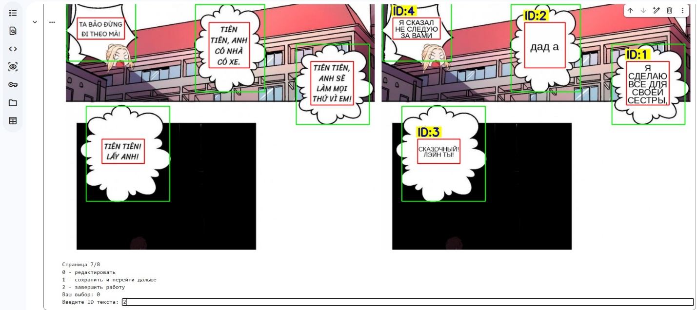</p>

   - Отображается текущий перевод выбранного фрагмента.
   - Вводится новый (редакционный) текст.

   <p>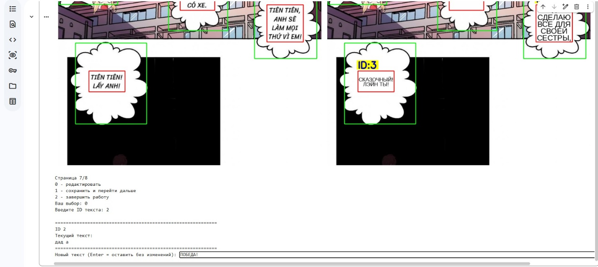</p>

   - После подтверждения изображение перерисовывается с учётом внесённых изменений.

   <p>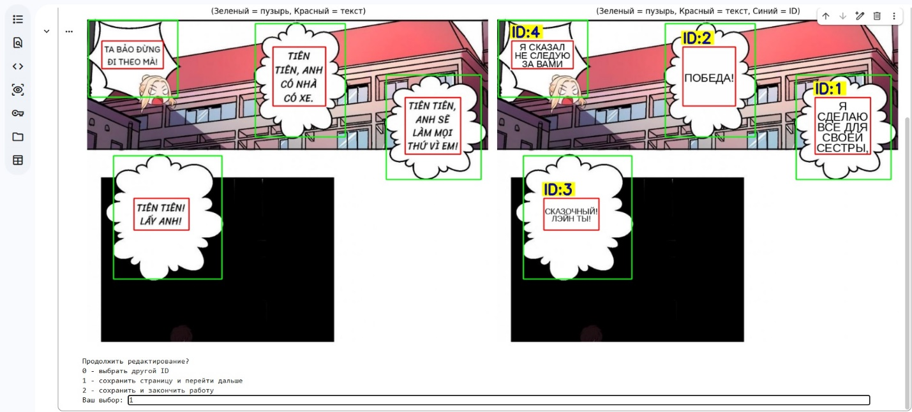</p>

5. После завершения работы с изображением оно сохраняется в формате JPEG без служебных боксов в директорию:

   ```
   /content/translated_img_{lang_name}
   ```

   где `lang_name` соответствует выбранному языку (`english` или `vietnam`).

<p>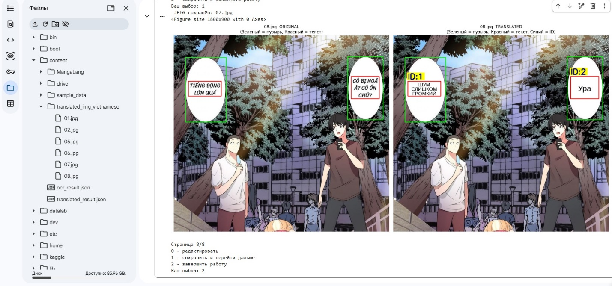</p>

Результаты работы, включая отредактированные изображения, следует сохранять локально, так как данные в Colab не сохраняются после завершения сессии.

---

## Используемые библиотеки

`ultralytics` (YOLOv8) · `easyocr` · `deep-translator` (Google Translate) · `opencv-python` · `Pillow` · `ipywidgets` (интерактивный редактор в Colab)

## Как воспроизвести

1. Скачать датасет по ссылке из [`Razmetka_manual/README.md`](Razmetka_manual/README.md), положить в `/content/drive/MyDrive/Base.zip` (Google Colab).
2. Запустить [`Yolo/YOLO_MOD.ipynb`](Yolo/YOLO_MOD.ipynb) — обучится модель, веса появятся в `/content/runs/detect/yolo/bubbles_text/weights/best.pt` и будут скопированы в Google Drive как `best_yolo_model.pt`.
3. Для демонстрации инференса — запустить [`Translate/Manga_Last.ipynb`](Translate/Manga_Last.ipynb), указав путь к `best_yolo_model.pt` и к архиву `MangaLang.zip` с демо-картинками.

> Повторное обучение не обязательно — в репозитории уже лежат готовые веса ([`Yolo/best_yolo_model.pt`](Yolo/best_yolo_model.pt)) и все метрики/графики обучения ([`Yolo/metrics/`](Yolo/metrics/)) для ознакомления.
